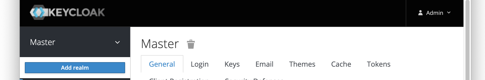
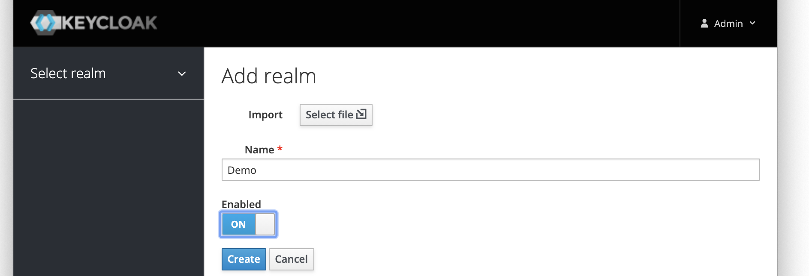
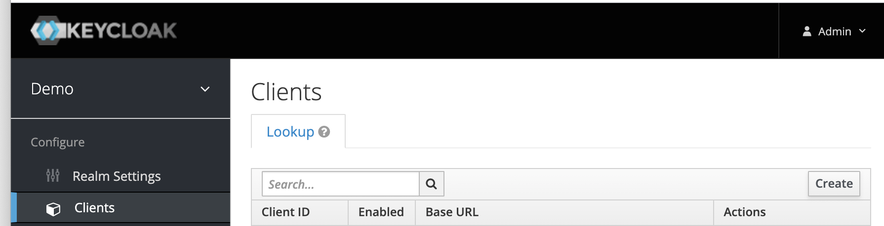
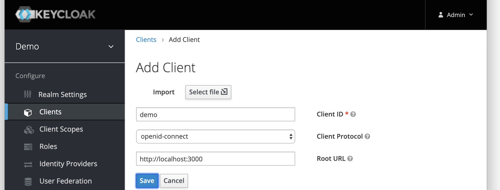
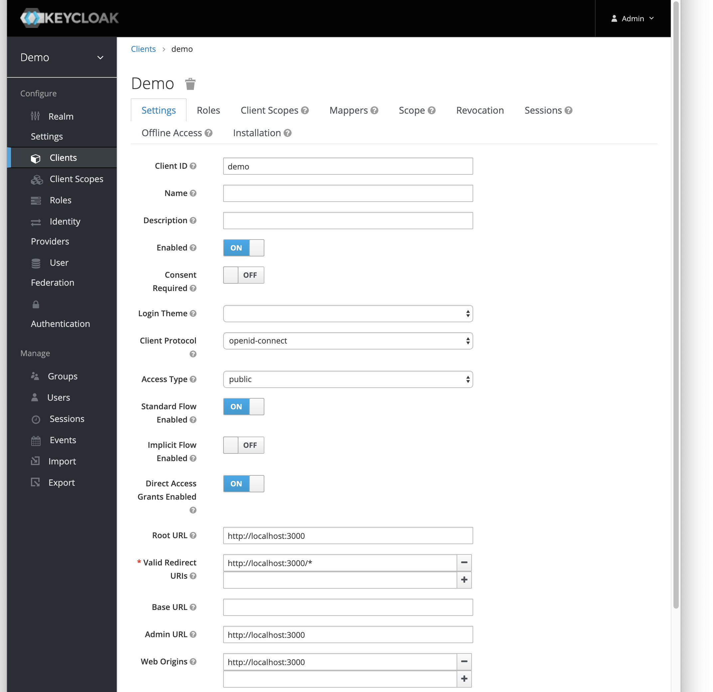

# [Securing React applications with KeyCloak](https://walkingtree.tech/detailed-guide-securing-react-applications-keycloak/)

## Getting started with Keycloak

### Quick steps to get started with Keycloak

- Downloading the server zip file, unzipping it
- Run `bin/standalone.sh`
- Open [http://localhost:8080/](http://localhost:8080/auth)

- First create the admin account
- Login to the admin console [http://localhost:8080/auth/admin/](http://localhost:8080/auth/admin/)

### Create Realm

- Create a new Realm called demo from the Master drop-down menu by clicking Add Realm option.

    

- Now select the newly created Realm from the drop-down, you can perform the other metadata setup.

    

### Create Client

- Next, create a Client for your React application which you want to secure with Keycloak

    

    

        Client ID: demo
        Protocol: ‘OpenID-Connect/SAML’
        Root Url: Application Hostname

- Client configuration requires details like

    Protocol: SAML/OpenID
    
    Resource Endpoint: https://localhost:3000/
        --> Application host with the React app
    
    Redirect URI: https://localhost:3000/*
        --> Destination after the auth completes

    

- Include the identity provider by adding social networks like Google, using which you want to facilitate sign-in by providing the google app client id and secret key

- For this, you need to add your application in the google developers console([https://console.developers.google.com/](https://console.developers.google.com/)).
  - Create a new google project.

  - Setup OAuth consent screen by selecting external/internal depending on the level of google authentication you wish to apply.
  
  - Create credentials by providing the keycloak url(http://localhost:8080/auth/realms/demo/broker/google/endpoint) as the Authorised redirect URIs. This will give you the client id and secret key which you will use in the next step for adding identity providers
  
- Add identity provider by using the client id and client secret you got from google console for your new application

## Process to setup React Application with Keycloak

Now we will see the steps of setting up react application with keycloak.

- Let’s first create our application using the below command.

    ```sh
    npx create-react-app react-keycloak-app
    ```

- Install the keycloak-js dependency

    ```sh
    npm install keycloak-js
    ```

- The keycloak configuration can be saved as a json file under the public folder by creating a resources subfolder.

The `keycloak.json` is as follows:

```json
{
    "realm": "demo",
    "auth-server-url": "http://localhost:8080/auth",
    "ssl-required": "none",
    "resource": "demo",
    "public-client": true,
    "verify-token-audience": true,
    "use-resource-role-mappings": true,
    "confidential-port": 0
}
```

- The logic to include the keycloak validation can be included in index.js before rendering the application or it can be included in a specific route when the user needs to be prompted for sign-in.

In this example, we will include the logic of keycloak initialization and refresh in the index.js as shown below:

```javascript
import Keycloak from 'keycloak-js';
//Get the keycloak configuration
let keycloak = Keycloak('./resources/keycloak.json');
//Initialization of the keycloak instance
keycloak
    .init({ onLoad: 'login-required' })
    .success((authenticated) => {
        if (!authenticated) {
            window.location.reload();
        } else {
            console.info("Authenticated");
        }

        //React Render on authentication
        ReactDOM.render(, document.getElementById('root'));

        //store authentication tokens in sessionStorage for usage in app
        sessionStorage.setItem('authentication', keycloak.token);
        sessionStorage.setItem('refreshToken', keycloak.refreshToken);

        //to regenerate token on expiry
        setTimeout(() => {
            keycloak.updateToken(70).success((refreshed) => {
                if (refreshed) {
                    console.debug('Token refreshed' + refreshed);
                } else {
                    console.warn('Token not refreshed, valid for '
                            + Math.round(keycloak.tokenParsed.exp + keycloak.timeSkew - new Date().getTime() / 1000) + ' seconds');
                }
            }).error(() => {
                console.error('Failed to refresh token');
            });
            }, 60000)
    })
    .error(() => {
        console.error("Authenticated Failed");
    });
```

- The React application can now be started using the npm start command. Open browser and navigate to localhost:3000

You will get redirected to the below login screen


Click on the google button and provide your google credentials to be authenticated and taken to the application page as shown below:


You can find the complete code on [github](https://github.com/abhilashahyd/react-keycloak-app)

